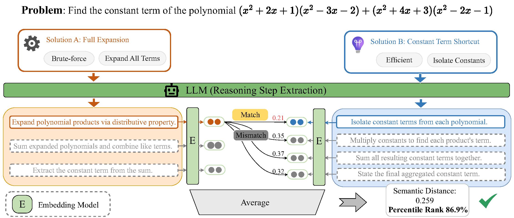

# Reasoning Path Divergence (RPD)

[**📖 ArXiv Paper**](https://arxiv.org/abs/2510.26122)

<p align="center">
  
</p>

Official code for the paper: **"Reasoning Path Divergence: A New Metric and Curation Strategy to Unlock LLM Diverse Thinking"**.

This repository contains the data curation pipeline that selects high-quality, diversely reasoned problems and answers.

## 🚀 Quick Start

Follow these steps to set up the environment and run the full pipeline.

### 1. Environment Setup

```bash
conda create -n rpd python=3.10 -y

conda activate rpd

pip install torch torchvision torchaudio

pip install vllm

pip install -r requirements.txt
```

### 2. Configuration Check

Before running, please check `config.py` to ensure correct settings:

* **`TEST_LIMIT`**: Set to `None` to process the full dataset.


### 3. Run Pipeline

```bash
bash run_pipeline.sh
```


---

## ⚠️ CRITICAL WARNING: Logic Alignment

The pipeline relies on a strict sequential processing order to align generated summaries with questions.

If you modify any parameters in **Step 2 (Length Filter)** or **Step 3 (Quality Filter)** and wish to re-run the pipeline, you **MUST** manually delete all downstream files generated by previous runs.

---

## 📂 Project Structure

```text
.
├── config.py                 # Global configuration (paths, thresholds, models)
├── utils.py                  # Helper functions (RPD metric, JSON parsing)
├── run_pipeline.sh           # Main execution script
├── requirements.txt          # Python dependencies
├── 01_prepare_dataset.py     # Download & Reorganize (Step 1)
├── 02_filter_length.py       # Filter by token length (Step 2)
├── 03_filter_quality.py      # Filter low-quality answers (Step 3)
├── 04_generate_summary.py    # Generate CoT summaries (Step 4)
├── 05_compute_matrix.py      # Compute RPD distance matrices (Step 5)
├── 06_select_problems.py     # Select top diverse problems (Step 6)
├── 07_select_answers.py      # Greedy selection of answers (Step 7)
└── data/
    ├── raw_source/           # Downloaded HuggingFace parquet files
    └── processed/            # Intermediate and final outputs


```
---

## 🖊️ Citation

If you find this code or paper useful, please consider citing:

```bibtex
@article{ju2025reasoning,
  title={Reasoning Path Divergence: A New Metric and Curation Strategy to Unlock LLM Diverse Thinking},
  author={Ju, Feng and Qin, Zeyu and Min, Rui and He, Zhitao and Kong, Lingpeng and Fung, Yi R},
  journal={arXiv preprint arXiv:2510.26122},
  year={2025}
}
```